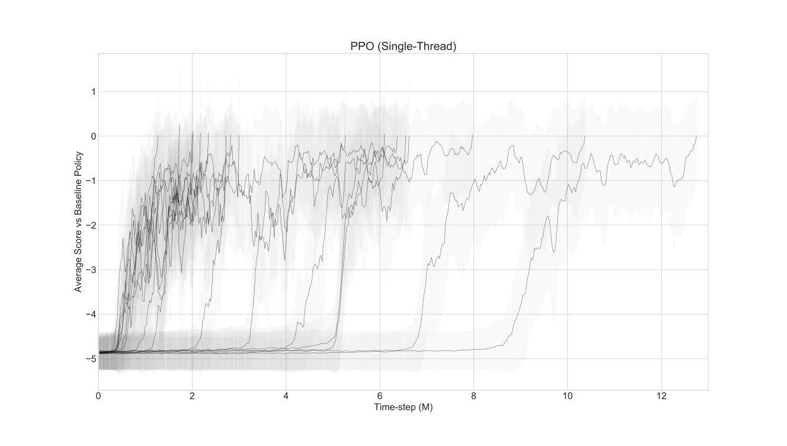
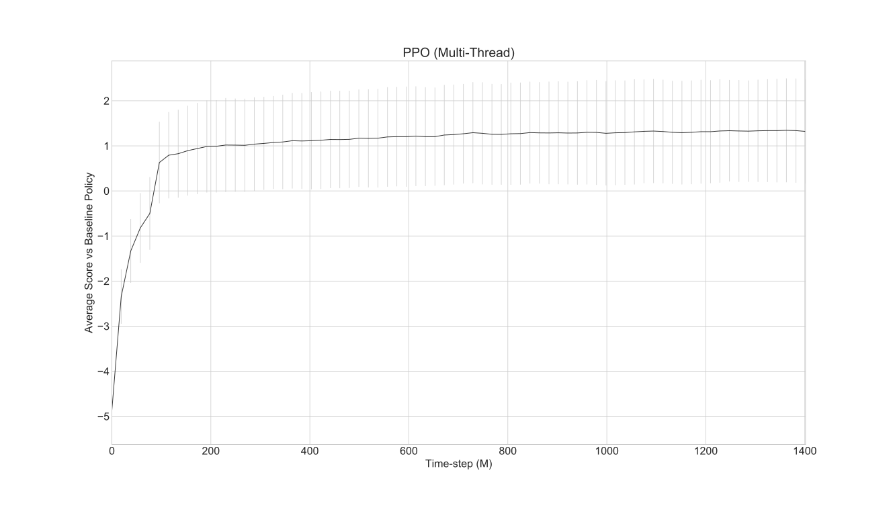
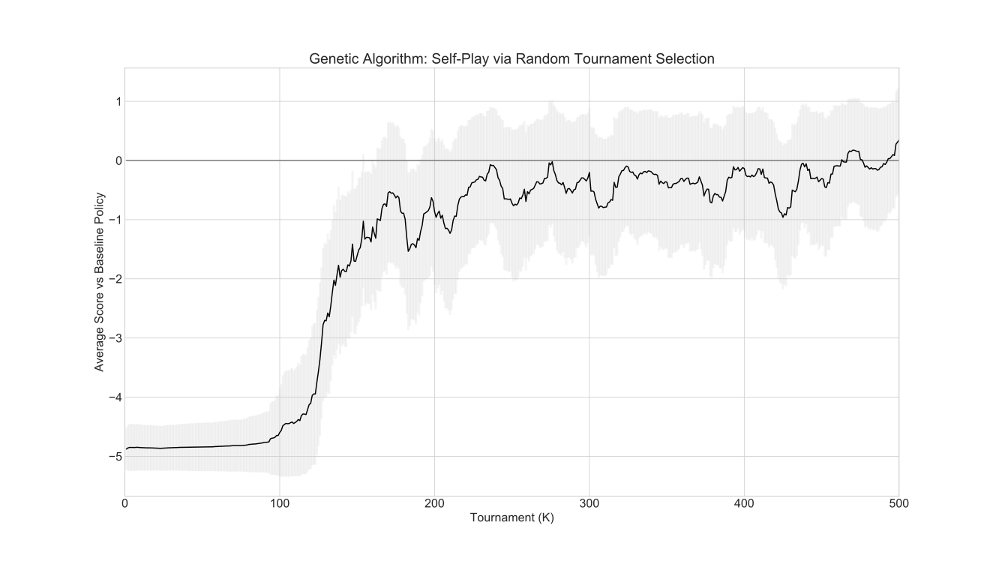
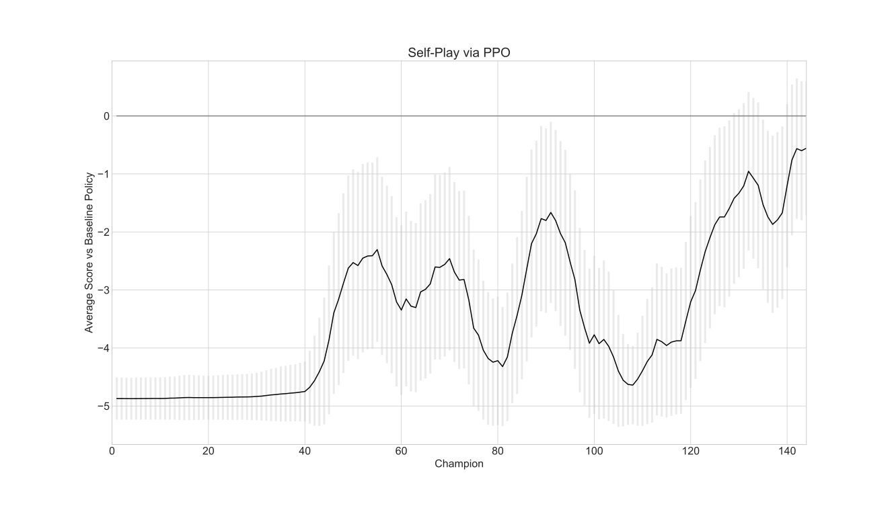

# A Tutorial on Training Self-Play Agents

Here, we provide training examples of 2 self-play methods: genetic algorithm (GA) and PPO. We show that self-play can produce agents that can defeat the baseline policy without the need to train against it. Before going into self-play, we will first go through examples that use standard RL methods such as PPO (using [stable-baselines3](https://github.com/DLR-RM/stable-baselines3)) to train an agent in the standard single-agent environment, where the agent learns by playing against the “expert” baseline policy from [2015](https://otoro.net/slimevolley/).

> **Note (modernized fork):** the training scripts now use stable-baselines3 (`PPO`) on Gymnasium rather than the old TensorFlow `stable-baselines` (`PPO1`). The `PPO1` hyperparameters map to SB3 `PPO` as follows: `timesteps_per_actorbatch`→`n_steps`, `optim_epochs`→`n_epochs`, `optim_stepsize`→`learning_rate`, `optim_batchsize`→`batch_size`, `lam`→`gae_lambda`, `entcoeff`→`ent_coef`, `clip_param`→`clip_range`. Multi-worker training (formerly MPI) now uses SB3's `SubprocVecEnv`.

## SlimeVolley-v0: State Observation Environment

<p align="left">
  </img>
</p>

We will first train agents to play Slime Volleyball using state observations (SlimeVolley-v0) and discuss various methods for training agents via self-play. First, we would like to measure the performance of agents trained to play directly in the single-agent environment against the built-in opponent that is controlled by the baseline policy.

## PPO Example: Train directly against baseline policy

In this first [example](https://github.com/hardmaru/slimevolleygym/blob/master/training_scripts/train_ppo.py), we run stable-baseline's PPO implementation to train an agent to play `SlimeVolley-v0`. In this environment, the agent will play against the built-in baseline policy.

To get a sense of the sample efficiency of the standard [PPO algorithm](https://arxiv.org/abs/1707.06347) for this task, below are results from running a single-thread PPO trainer (see [code](https://github.com/hardmaru/slimevolleygym/blob/master/training_scripts/train_ppo.py)) 17 times with different initial random seeds. The hyperparameters used are roughly the same as the ones in the [stable-baselines](https://github.com/hill-a/stable-baselines) examples chosen for mujoco environments. Training stops when the policy evaluated 1000 times achieves a mean score above zero versus the baseline policy inside the environment.



Out of 17 trials with different initial random seeds, the best one solved the task in 1.274M timesteps, and the median number of timesteps is 2.998M. On a single CPU machine, the wall clock speed to train 1M steps is roughly 1 hour, so we can expect to see the agent learning a reasonable policy after a few hours of training. It is interesting to note that some trials took PPO a long time to learn a reasonable strategy, and it could be due to the fact that we are training a randomly initialized network that knows nothing about Slime Volleyball, against an expert player right at the beginning. It's like an infant learning to play volleyball against an Olympic gold medalist. Here, our agent will likely receive the lowest possible score all the time regardless of any small improvement, making it difficult to learn from constant failure. That PPO still manages to eventually find a good policy is a testament of how good it is. This is an important point that we will revisit.

In addition to sample efficiency, we want to know what the best possible performance we can get out of PPO. We ran multi-processor PPO (see [code](https://github.com/hardmaru/slimevolleygym/blob/master/training_scripts/train_ppo_vec.py)) on a 96-core CPU machine for a while and achieved an average score of 1.377 ± 1.133 over 1000 trials. The highest possible score is 5.0.

<p align="left">
  </img>
  <br/><i>Training multi-processor version of PPO. Optimized for wall clock over sample efficiency.</i>
</p>

While PPO trained an agent to play Slime Volleyball against an expert baseline policy, it is of no surprise that, given enough training, it can eventually defeat the baseline policy consistently. We want to see if methods trained with self-play, *without* access to an expert baseline policy, are good enough to consistently beat the baseline policy. Afterall, the baseline policy was also originally trained using [self-play](https://blog.otoro.net/2015/03/28/neural-slime-volleyball/) in 2015. We can also investigate whether the PPO method trained against the baseline policy overfits to that particular agent.

# Self-Play Methods

We have shown that standard RL algorithms can defeat the baseline policy in SlimeVolley-v0 by simply training agents to play from scratch directly against the built-in opponent. But what if we didn't have an expert opponent to begin with to learn from? With self-play, we train agents to play against a version of itself (either a past version for the case of PPO, or a sibling in the case of a genetic algorithm (GA)), so they can become incrementally better players over time. We also want to measure the performance of agents trained using self-play against agents trained against the expert.

## Self-Play via Genetic Algorithm

While self-play has gained popularity in Deep RL, it has actually been around for decades in genetic algorithms (see references below) in the evolutionary computing literature. It is also really easy to implement–our [example](https://github.com/hardmaru/slimevolleygym/blob/master/training_scripts/train_ga_selfplay.py) consists of a dozen or so lines of code that implements it.

For demonstration purposes, we are going to use the simplest version of tournament selection GA, without any bells and whistles. It is even simpler than the genetic algorithm in [2015](https://blog.otoro.net/2015/03/28/neural-slime-volleyball/) that trained the baseline policy.

Tournament Selection by Genetic Algorithm:
```
Create a population of agents with random initial parameters.
Play a total of N games. For each game:
  Randomly choose two agents in the population and have them play against each other.
  If the game is tied, add a bit of noise to the second agent's parameters.
  Otherwise, replace the loser with a clone of the winner, and add a bit of noise to the clone.
```

In Python pseudocode:
```python
# param_count is the number of weight parameters in the neural net agent
population = np.random.normal(size=(population_size, param_count))

epsilon = 0.1 # small amount of gaussian noise to be added to weights

for tournament in range(total_tournaments):

  # randomly choose two different agents in the population
  m, n = np.random.choice(population_size, 2, replace=False)

  policy1.set_model_params(population[m])
  policy2.set_model_params(population[n])

  # tournament between the mth and nth member of the population
  score = rollout(env, policy1, policy2)

  # if score is positive, it means policy1 won.
  if score == 0: # if the game is tied, add noise to one of the agents.
    population[n] += np.random.normal(size=param_count) * epsilon
  if score > 0: # erase the loser, set it to the winner and add some noise
    population[n] = population[m] + np.random.normal(size=param_count) * epsilon
  if score < 0:
    population[m] = population[n] + np.random.normal(size=param_count) * epsilon
```

In the actual [code](https://github.com/hardmaru/slimevolleygym/blob/master/training_scripts/train_ga_selfplay.py), we track how many generations an agent has survived for (e.g. its evolutionary lineage), as a proxy for how good it is within the population without actually computing who is best to save time.

We ran this code for 500,000 tournaments on a single CPU which took only a few hours. Due to the simplicity of this method, the wall clock time per step is surprisingly fast compared to RL or even other ES algorithms. As a challenge, you may want to try implementing an asynchronous parallel processing version of this algorithm for performance.

After 500K games, the agent in the population that had the longest evolutionary lineage is used as a proxy for the best agent in the population. It played against the original baseline policy for the first time, and achieved an average score of 0.353 ± 0.728 over 1000 episodes. While it underperformed PPO which trained directly against the baseline policy, we notice when we evaluated self-play GA against PPO and measured the agents' performance head on, the GA completely dominated the PPO agent, suggesting that the earlier agents had somewhat overfit to a particular opponent's playing style.

We also logged the historical agent parameters during the tournament selection process, and evaluated each of them against the baseline policy afterwards to get a sense of the improvement over time:



**References**

*Blickle and Thiele, [A comparison of selection schemes used in evolutionary algorithms](https://pdfs.semanticscholar.org/a553/2dda955228ea44e2d224c6b42916959705b1.pdf), Evolutionary Computation, 1996.*

*Miller and Goldberg, [Genetic algorithms, tournament selection, and the effects of noise](https://pdfs.semanticscholar.org/df6e/e94e2cf14c38e9cff4d2446a50db0aedd4ca.pdf), Complex Systems, 1995.*

## Self-Play via PPO

Reinforcement learning can also incorporate self-play, by incorporating in the environment an earlier version of the agent, allowing the agent to continually learn to improve against itself. This approach also leads to a natural curriculum that adapts to the agent's current abilities, because unlike starting out against an expert opponent, here, the level of difficulty will be on par with the agent. An outline of a self-play algorithm for RL:

```text
Champion List:
Initially, this list contains a random policy agent.

Environment:
At the beginning of each episode, load the most recent agent archived in the Champion List.
Set this agent to be the Opponent.

Agent:
Trains inside the Environment against the Opponent with our choice of RL method.
Once the performance exceeds some threshold, checkpoint the agent into the Champion List.
```

There are a few ways we can implement this algorithm. We can wrap the multi-agent loop in a new gym environment, and train the agent in the new environment. Alternatively, an easier way is to directly replace the `policy` object in the `SlimeVolley-v0` environment with previous checkpointed PPO agents (see [code](https://github.com/hardmaru/slimevolleygym/blob/master/training_scripts/train_ppo_selfplay.py)). In our example, the current PPO agent must achieve an average score above 0.5 against the previous champion in order to become the next champion. After running the self-play code, the training converged at around 140 generations (it takes a long time after that to produce the next Champion). The most recent champion is then evaluated for the first time against the baseline policy achieving an average score of -0.371 ± 1.085 over 1000 episodes. We also logged all previous Champion policies and evaluated those as well against the baseline policy to retroactively measure its training progress:



Note that Bansel et al. (see References below) discuss alternate ways to sample from the history of archived agents, since setting it to the most recent opponent may lead to the agent specializing at playing against its own policy. This may explain the fluctuations observed in the performance chart. In our [implementation](https://github.com/hardmaru/slimevolleygym/blob/master/training_scripts/train_ppo_selfplay.py), we modified the call back evaluation method in stable-baselines to assign a number label to each champion, so if we wanted to, we can implement such sampling methods, and we leave it as a challenge to the reader to experiment with variations.

**References**

Bansal et al., [Emergent complexity via multi-agent competition](https://arxiv.org/abs/1710.03748), ICLR, 2018.

## Results Summary

Table of average scores of various methods discussed versus the default baseline policy ([1000 episodes](https://github.com/hardmaru/slimevolleygym/blob/master/eval_agents.py)):

|Method|Average Score
|---|---|
|Maximum Possible Score|5.0
|PPO | 1.377 ± 1.133
|GA (Self-Play) | 0.353 ± 0.728
|PPO (Self-Play) | -0.371 ± 1.085
|Random Policy | -4.866 ± 0.372

Table of average scores of the discussed approaches versus each other ([1000 episodes](https://github.com/hardmaru/slimevolleygym/blob/master/eval_agents.py)):

|Method|PPO|GA<br/>(Self-Play) |PPO<br/>(Self-Play)
|---|---|---|---|
|PPO | — | -3.128 ± 1.509 | -0.119 ± 1.4
|GA<br/>(Self-Play) | 3.128 ± 1.509 | —  | 0.42 ± 0.717
|PPO<br/>(Self-Play) | 0.119 ± 1.46 | -0.420 ± 0.717 | —

In the above table, the score represents the agent under the Method column playing against the Method in the top row. While we saw earlier that the simple GA didn't perform as well as methods that trained against the baseline policy, the GA ended up defeating all other approaches, and also completely dominated PPO. Performing well against one opponent may not necessarily transfer to other opponents.

# Pixel Observation Environment

Training an agent to play Slime Volleyball only from pixel observations is more challenging–not only does the agent need to work with a much larger observation space, it also needs to learn to infer important information such as velocities that are not explicitly provided. We approach this problem by taking advantage of the vast existing work in Deep RL that focused on training agents to play Atari games from pixels, and created the pixel version of the environment that looks and feels like an Atari gym environment. As an added bonus, we can use the same hyper parameters for existing methods that were already tuned for Atari games, without the need to perform hyper parameter search from scratch.

## Pixel Observation PPO

The PPO implementation in stable-baselines3 includes a CNN Policy for working with pixel observations. The standard pre-processing for Atari RL agents is to first convert each RGB frame into grayscale, resize them to 84x84 pixels, and consecutive 4 frames are stacked together as one observation so local temporal information could be inferred.

<p align="left">
  </img>
  <br/><i>PPO trained to play from pixels using hyperparameters and settings (e.g. 4-frame stacking) pre-tuned for Atari.</i>
</p>

Although not required, we did find that it was easier to train the pixel observation version of the PPO agent using a reward function that incorporated a small survival reward to facilitate early learning. This can be incorporated by applying the wrapper `SurvivalRewardEnv` over the original environment (before the Atari pre-processing), or simply make the environment using the registered env ID `SlimeVolleySurvivalNoFrameskip-v0` (refer to [code](https://github.com/hardmaru/slimevolleygym/blob/master/training_scripts/train_ppo_pixel.py)).

The agent is evaluated in the original environment without the extra survival bonus rewards. The best PPO agent (using pixel observations) achieved a score of 0.435 ± 0.961 versus the baseline policy (using state observations).

